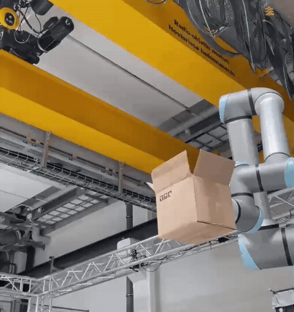
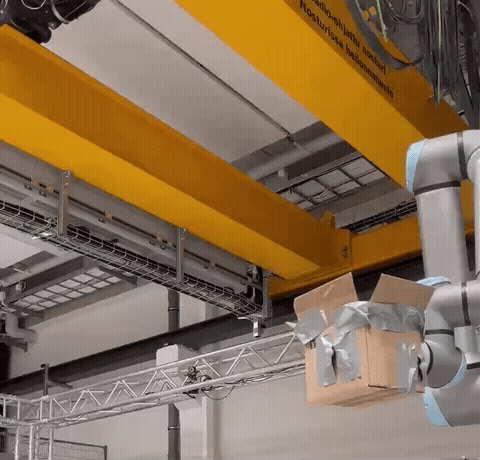
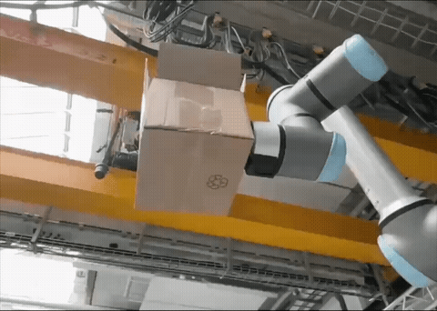

# MABALLS

```
M
A
B
A
L
L
S
```

**M**arker-**A**ssisted: the ball and the robot both wear OptiTrack markers, so the mocap system tracks the ball's flight and the robot's own base/tool frames in the same space, continuously.



**B**allistic **A**cquisition: ball positions are fit to a projectile trajectory and intersected with a fixed catch plane to acquire a single intercept point and time.



**L**ow-**L**atency: actuator speed and move-time limits are measured on the real arm, so it only commits to a catch once it can provably beat the ball there.

**S**ervoing: once committed, target poses stream to the arm at 125Hz, letting it keep refining its aim as the trajectory prediction sharpens.


*slow motion — arm direction updating as the prediction converges*

## Live visualization

`catch.py --plot` renders each throw's actual ball path, the arm's TCP path, and every commit/re-aim point, time-colored, in real time.

<!-- screenshot: catch.py --plot window -->
<!-- screenshot: catch.py --plot window -->

## Status

Working end to end on real hardware. Best measured catch rate over 62 throws: 81%.
